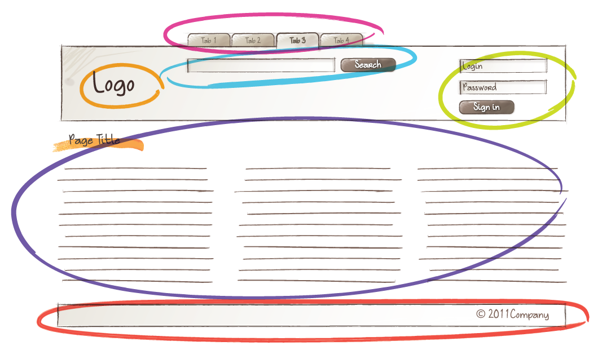
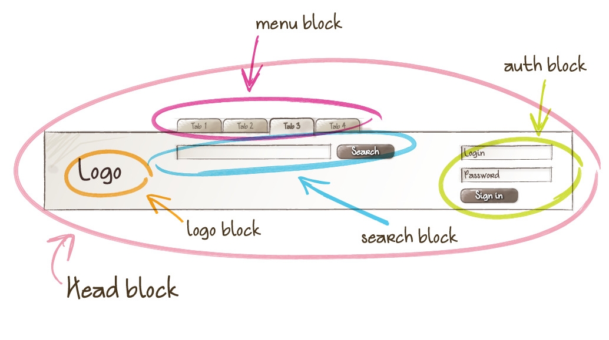

# Plan of Action

## Step 1: Identify Blocks

###### Getting to know the UI

Imagine them like Building Blocks. A site is made up of building blocks. Each block can have many blocks within.

#### Let's say this is the UI


#### We can Identify some key groups that could be considered blocks:



Note that these would be in addition to some bigger blocks such as containers, sections, headers, and, ultimately, the `<body>` and `<html>`.

#### Mark them up and give them unique names:



Notice, again how blocks are nested within each other.

## Step 2: Identify Elements within those blocks


#### This is, let's say, a Search Block


#### It contains 


## Step 3: Mess with the Code

Next comes the task of figuring out which rules that have already been written affect which blocks and block-elements. This is [no mean feat](https://en.wiktionary.org/wiki/no_mean_feat).

### So what's the process?
###### Work in progress (to be refined)

1. Arm yourself with Text styles and colours as determined by the [Styleguide]()
1. Delete this evil, shameful, sinful thing: `<link rel="stylesheet" href="https://code.getmdl.io/1.1.2/material.indigo-pink.min.css">`. *C'mon, you knew this was coming.*
1. Run the app
2. Load a view on one screen. 
2. Determine and inspect a **Block**
3. Find the bit of CSS that styles it **and**
4. Find the markup partial(s) (remember that changing the css is like bookkeeping - you do it all twice)
    - Finding the partial may require searching through all the views so if you can do an equivalent to ST2's "Find in Files" then do so. 
5. Determine what lives inside this block - **Elements** and **other Blocks** - then make placeholder CSS rules for the block you're focusing on and all its block-elements (remembering not to lose track of the other blocks for later).
6. Gather all the incumbent rules affecting this block to the same place in the CSS file. 
    - this is where the inspector tool comes in very handy
1. Transfer the declarations across from the incumbent rules to the newly created BEM rules
1. Clean up that markup! Remove useless classes and class-less divs and put your shiny new classes on the elements you consider to be 'Elements'
1. Refactor both sides if you can - good bookkeeping ;)


### Example

- I have identified that the Card that shows information about an event (on the Client / all Events view) is a Block.
- Inspecting it reveals that it has the class `.box`
- I find the `.box {}` style declaration at line 291 of `app.css` and leave it open
- In a new tab I find `<div class="box">` is in two partials so I open them both
    - `event.html` features a `.box` 4 times
    - `client.html` features a `.box` once.
  
  *The client view is the one I'm actually looking at one the screen so I'll focus on this one.*

- I determine that the Card block contains:
    - 2 Button Blocks
    - A Header Element
    - A title Element
    - A body Element
    - 3 subtitle Elements (Date, Venue, Submissions)
    - 2 Label Elements (Deadline Date, Notification Date)
    - 4 Data Elements
        - 2 of which can be considered variations

- I gather all of the CSS rules that pertain to these elements together (just focusing on the Card elements for now) to where the `.box` rule is in the CSS. 
    - In the process of doing so I created placeholder rules for the identified elements:
```
.card__header {}
.card__title {}
.card__body {}
.card__subtitle {}
.card__label {}
.card__data {}
```
    
I have gathered the following incumbent rules:
```
.box {}
.border-bottom-div {}
.no-margin {}
.text-type-one {}
.text-type-two {}
.small-height-div {}
```

---

- This means I can now confidently go through the partial and remove any styles that I do not have control over and should no longer have any effect *(assuming you actually repented for your sins and followed step 2)* - namely things like: `mdl-grid` and `mdl-cell--4-col-tablet`.
- With all that shit out of the way we can get back to the task of refining the CSS

---

- I see that `<div class="border-bottom-div">` contains the `<h5>` acting as the title of the Card.
- I copy the relevant declaration from the `.border-bottom-div` rule to the newly made `.card__header` rule.
    - I make sure not to delete that `.border-bottom-div` rule.
- I see that `<h6 class="no-margin">` acts as the subtitles of the card.
- I copy the relevant declaration from the `.no-margin` rule to the newly made `.card__subtitle` rule.
    - I make sure not to delete that `.no-margin` rule.

##### Repeat this process until all the css is duped over.

- Finally I create a `.card {}` and transfer over the styles from `.box`

This is what I have produced:

```
.card {
  margin: 0 3em 3em;
  border: 1px solid #808080;
  box-shadow: 5px 5px 5px #888888;
}
.card__header {
  border-bottom: 1px solid grey;
}
.card__title {}
.card__body {}
.card__subtitle {
  height: 1.5em;
  padding-top: 0;
  padding-bottom: 0;
  margin: 0;
}
.card__label {
  color: #808080;
  margin: 0;
}
.card__data {
  color: #808080;
  margin: 0;
}
.card__data--blue {
  color: #003066;
  margin: 0;
}
```

###### Notice the one modifier?
- Next I go through and clean up the partial - removing any class-less `<div>`s and replacing the incumbent classes with my new BEM classes.

### Before:

#### client.html:30-74

```
<div class="box">
  <div class="mdl-grid border-bottom-div">
    <div class="mdl-cell mdl-cell--8-col mdl-cell--4-col-tablet">
      <h5>{{this.event_title}}</h5>
    </div>
    <div class="mdl-cell mdl-cell--4-col mdl-cell--4-col-tablet">
      <a class='secondary-action-button right' href='/clients/{{this.client_id}}/events/{{this.event_id}}/update-page'> Edit Event</a>
      {{#if @root.admin}}
        <a class ='primary-action-button right ' href='/events/{{this.event_id}}'>Go to event</a>
      {{/if}}
    </div>
  </div>
  {{#unless @root.admin}}
  <div class="mdl-grid">
    <div class="mdl-cell mdl-cell--4-col mdl-cell--4-col-tablet">
      <h6 class="no-margin">Date</h6>
      <p class="text-type-one">{{this.event_date}}</p>
    </div>
    <div class="mdl-cell mdl-cell--8-col mdl-cell--4-col-tablet">
      <h6 class="no-margin">Venue</h6>
      <p class="text-type-one">{{this.venue}}</p>
    </div>
  </div>

  <div class="mdl-grid small-height-div">
    <div class="mdl-cell mdl-cell--12-col">
      <h6 class="no-margin">Submissions</h6>
    </div>
  </div>

  <div class="mdl-grid">
    <div class="mdl-cell mdl-cell--8-col mdl-cell--4-col-tablet">
      <h6 class="text-type-one">Deadline Date</h6>
      <p class="text-type-two">{{this.deadline_date}}</p>
      <h6 class="text-type-one">Notification Date</h6>
      <p class="text-type-two">{{this.outcome_notification_date}}</p>
    </div>

    <div class="mdl-cell mdl-cell--4-col mdl-cell--4-col-tablet go-to-button-div">
      <a class ='primary-action-button right go-to-button' href='/events/{{this.event_id}}'>Go to event</a>
    </div>
  </div>
  {{/unless}}

</div>
```

### After

```
<div class="card">
    <div class="card__header">

        <h5 class="card__title">{{this.event_title}}</h5>

        <a class='secondary-action-button right' href='/clients/{{this.client_id}}/events/{{this.event_id}}/update-page'> Edit Event</a>
        {{#if @root.admin}}
        <a class ='primary-action-button right ' href='/events/{{this.event_id}}'>Go to event</a>
        {{/if}}

    </div>
    {{#unless @root.admin}}
    <div class="card__body">

        <h6 class="card__subtitle">Date</h6>
        <span class="card__data">{{this.event_date}}</span>

        <h6 class="card__subtitle">Venue</h6>
        <span class="card__data">{{this.venue}}</span>

        <h6 class="card__subtitle">Submissions</h6>

        <span class="card__label">Deadline Date</span>
        <span class="card__data card__data--blue">{{this.deadline_date}}</span>
        <span class="card__label">Notification Date</span>
        <span class="card__data card__data--blue">{{this.outcome_notification_date}}</span>

        <div class="go-to-button-div">
        <a class ='primary-action-button right go-to-button' href='/events/{{this.event_id}}'>Go to event</a>
        </div>

    </div>
    {{/unless}}
</div>
```

Notice, to enforce semantic markup I have changed some `<h6>` elements into span elements since their UI purpose is to be a label or data, not a headline. 

I can further refactor the CSS now that there is no need to override the useragent stylesheet's margin on headline elements as well as short-handing the margin declarations on the block.

### Before:

#### app.css

```
.box {
  margin-left: 3em;
  margin-right: 3em;
  margin-bottom: 3em;
  border: 1px solid #808080;
  box-shadow: 5px 5px 5px #888888;
}

.border-bottom-div {
  border-bottom: 1px solid grey;
}

.no-margin {
  margin: 0;
}

.text-type-one {
  color: #808080;
  margin: 0;
}

.text-type-two {
  color: #003066;
  margin: 0;
}

.small-height-div {
  height: 1.5em;
  padding-top: 0;
  padding-bottom: 0;
}

```

### After:

```
/*///////////// C A R D /////////////*/

.card {
  margin: 0 3em 3em;
  border: 1px solid #808080;
  box-shadow: 5px 5px 5px #888888;
}

.card__header {
  border-bottom: 1px solid grey;
}
.card__title {}

.card__body {}
.card__subtitle {
  height: 1.5em;
  padding-top: 0;
  padding-bottom: 0;
  margin: 0;
}
.card__label {
  color: #808080;
}
.card__data {
  color: #808080;
}
.card__data--blue {
  color: #003066;
}
```

## It looks worse than before

Yes that's because we've only just begun. Once our CSS tools are all in place we can come back and make it look like it's supposed to!